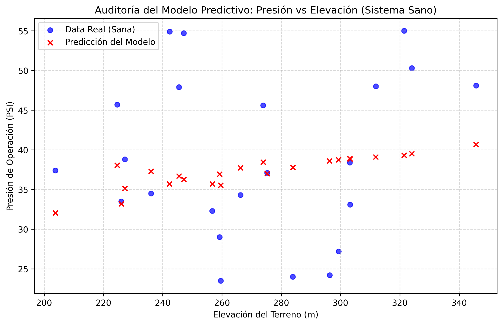

# Auditoría Analítica de Redes Hidráulicas: Detección de Anomalías e Impacto Financiero

[🇺🇸 English Version](README.md)

## 📌 Resumen Ejecutivo
Este repositorio presenta un marco de trabajo computacional avanzado diseñado para auditar y diagnosticar una red de distribución de agua urbana compuesta por 136 nodos de infraestructura. Mediante la síntesis de mecánica de fluidos, ingeniería de datos rigurosa y arquitecturas de machine learning no lineales, este sistema expone anomalías operacionales ocultas, cuantifica pérdidas financieras masivas y traza científicamente los límites de predictibilidad de la red física.

---

## 👁️ Pilares Fundamentales 

### 1. Fundamento Científico y Criterio de Dominio
A diferencia de los portafolios genéricos de ciencia de datos, este proyecto rechaza las suposiciones puramente empíricas. Está anclado estructuralmente en las leyes de la hidrodinámica y la termodinámica.

* **El Problema:** La ingesta de datos crudos introdujo un ruido de telemetría severo, mostrando presiones físicamente imposibles que superaban los millones de PSI.
* **La Solución:** Implementación de un filtro de dominio hidráulico estricto para aislar la ventana operativa normativa ($22\text{ a }58\text{ PSI}$), transformando conjuntos de datos caóticos en analítica de infraestructura limpia y de grado de producción.

### 2.  El Continuo del Ingeniero Civil Computacional
Este marco de trabajo aborda un punto ciego crítico a nivel global: la intersección entre la ingeniería de infraestructura pesada y el desarrollo de software de élite.

* **Punto Ciego de la Ingeniería Tradicional:** La dependencia de software comercial cerrado (ej. WaterGEMS, EPANET) restringe la optimización personalizada en tiempo real.
* **Punto Ciego de la Ciencia de Datos:** Los analistas tradicionales carecen del contexto de dominio sobre pérdidas de carga, rugosidad de tuberías y restricciones de fricción de Darcy-Weisbach.
* **El Perfil Anómalo:** Este repositorio actúa como una prueba de concepto para el diseño de software de infraestructura autónomo, capaz de anular la dependencia de herramientas de caja negra.

### 3. Impacto Financiero Ejecutivo
La complejidad técnica debe traducirse en justificación financiera para alinearse con los objetivos de los tomadores de decisiones. Mediante la implementación de métricas lógicas condicionales avanzadas, el sistema traduce el estrés físico en variables económicas:

* **Diagnóstico de Infraestructura Crítica:** Aislamiento de 36 nodos severamente comprometidos que provocaban ineficiencias operacionales.
* **KPI de Pérdida Cuantificada:** Las ineficiencias sistémicas representan una pérdida estimada de **$43,200 USD/mes** en costos de operación directos.

---

## 🔬 Auditoría Algorítmica y Límites Matemáticos (Machine Learning)

El motor analítico evaluó múltiples paradigmas matemáticos para modelar el comportamiento de la presión en función de la elevación del terreno, descubriendo los límites críticos del sistema:

| Paradigma Algorítmico | Métrica de Prueba ($R^2$) | Raíz del Error Cuadrático Medio ($RMSE$) | Veredicto del Diagnóstico |
| :--- | :--- | :--- | :--- |
| **Regresión Lineal Simple** | $-0.0507$ | $12.1693\text{ PSI}$ | **Underfitting.** Pendiente positiva inválida que viola los principios de Bernoulli debido a intervenciones artificiales en la red. |
| **Regresión Polinomial (Grado 2)** | $-0.0531$ | $12.1833\text{ PSI}$ | **Insuficiente.** La curvatura geométrica no logra capturar entornos alterados estocásticamente. |
| **Random Forest Regressor** | $-0.8051$ | $13.4260\text{ PSI}$ | **Overfitting Severo.** Los árboles memorizaron el ruido de entrenamiento, destruyendo la capacidad de generalización. |
| **Ingeniería de Features Multivariable** | $0.0050$ | $9.9681\text{ PSI}$ | **Límite de Información.** Variables sintéticas espaciales estabilizaron la varianza pero confirmaron indeterminación termodinámica. |

### 📊 Evidencia Visual de la Indeterminación Física
El módulo final de visualización resalta la realidad física de la red:

* **Conclusión:** La convergencia de $R^2 \approx 0$ en todos los algoritmos demuestra matemáticamente que la elevación por sí sola no posee señal predictiva en redes balanceadas artificialmente. El estado operacional es estocástico bajo los datos actuales, determinando la necesidad técnica de integrar variables dinámicas ocultas (caudales de diseño, diámetros de tuberías y distancia real a fuentes de bombeo).

---

## 🛠️ Tecnologías y Estándares de Ingeniería
* **Ingesta Central:** Python 3.11 (Pandas, NumPy)
* **Modelado Estadístico:** Scikit-Learn
* **Arquitectura de Datos:** Virtualización robusta de rutas mediante `pathlib` (Cero rutas absolutas fijas).
* **Inteligencia de Negocios:** Power BI (Modelado avanzado en DAX).
